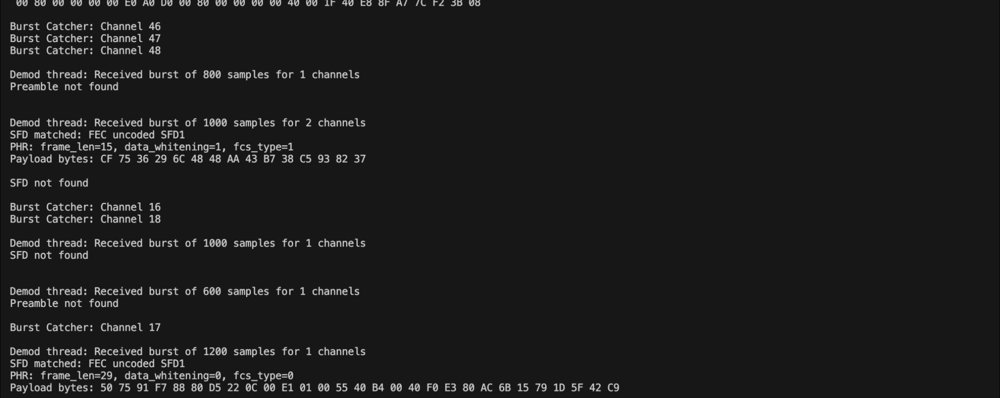

日本語版は[こちら](./README-ja.md)<br><br>

# Wi-SUN ARIB STD-T108 Sniffer

This project is a Wi-SUN sniffer prototype for the Japanese profile defined by ARIB STD-T108. It captures IQ samples from a USRP, splits the 10 MHz input bandwidth into narrow channels, detects bursts, demodulates FSK/GFSK packets, and prints basic PHY parsing results to standard output.

## Status

The current codebase already includes:

- USRP-based RX streaming through UHD
- A 50-channel polyphase channelizer built on FFTW
- Burst detection with CFAR and burst grouping
- FSK/GFSK demodulation
- Simple packet analysis for preamble, SFD, PHR, and payload dump
- Built-in self-tests for the channelizer and modem loopback path

At the moment, packet parsing is still focused on PHY-level inspection rather than a full Wi-SUN / IEEE 802.15.4g decoder.



## Processing Pipeline

The executable starts three main worker threads:

1. `usrp_rx_thread`
   Reads complex baseband samples from a USRP at 10 Msps.
2. `channelizer_thread`
   Splits the input into 50 channels, runs CFAR-based burst detection, and forwards completed bursts.
3. `demodulator_thread`
   Demodulates burst candidates and analyzes the recovered bit stream.

## Repository Layout

- `main.c`: program entry point, CLI options, thread setup
- `usrp.c`: UHD device setup and streaming
- `channelizer.c`: polyphase channelizer, CFAR, burst grouping
- `channelizer_test.c`: built-in self-tests
- `demodulator.c`: burst demodulation flow
- `fsk.c`: FSK/GFSK modem utilities
- `packet.c`: simple packet field parsing and payload dump
- `brb.c`: blocking ring buffer between channelizer and demodulator
- `lfrb.c`: lock-free ring buffer between USRP RX and channelizer
- `build.sh`: convenience build script
- `CMakeLists.txt`: CMake build definition

## Requirements

### Hardware

- MacBook Pro (M1 Pro, 2021, 32GB RAM)
- USRP B210 / LibreSDR B220mini (USRP Clone)
- DIAMOND SRH805S small handheld antenna

The above hardware has been tested and confirmed to work.

### Runtime / development dependencies

- CMake
- A C compiler with C99 support
- UHD
- FFTW3
- POSIX threads

### macOS example

```bash
brew install cmake pkgconf uhd fftw
```

## Build

### Release build

```bash
./build.sh
```

### Debug build

```bash
./build.sh debug
```

The executable is generated at:

```bash
./build/wisun-sniffer
```

## Command-Line Options

```text
-a  RX antenna name
-c  RX channel index
-f  RX frequency in Hz
-g  RX gain
-m  Run FSK/GFSK modem loopback self-test on the specified channel and exit
-t  Run the channelizer single-tone self-test and exit
-h  Print help
```

## Usage

### 1. Run the channelizer self-test

```bash
./build/wisun-sniffer -t
```

This runs a synthetic single-tone test across the channelizer and exits without touching the USRP.

### 2. Run the modem loopback self-test

```bash
./build/wisun-sniffer -m 10
```

This generates a synthetic modulated signal for the specified channel, pushes it through the channelizer and demodulator path, and reports pass/fail results.

### 3. Start live sniffing from a USRP

```bash
./build/wisun-sniffer
```

Typical runtime output includes:

- detected burst channel information
- demodulator activity
- SFD match result
- PHR fields such as frame length, whitening flag, and FCS type
- payload bytes in hex

Stop the program with `Ctrl+C`.

## Notes for Live Capture

- The current capture path expects a USRP that works with UHD and can sample at 10 Msps.
- The default tuning is meant for Japanese Wi-SUN observations. Adjust frequency, antenna, gain, and channel to match your hardware and RF environment.
- The packet analyzer currently prints PHY-oriented information and raw payload bytes. Higher-layer decoding is not implemented yet.

## Known Limitations

- README examples assume the UHD device is discoverable with default UHD settings.
- TX-related code exists only for test use and is disabled by default.
- No install target or package definition is provided yet.

## Future Improvements

- Add richer ARIB STD-T108 / IEEE 802.15.4g packet decoding
- Export decoded packets to PCAP or structured logs
